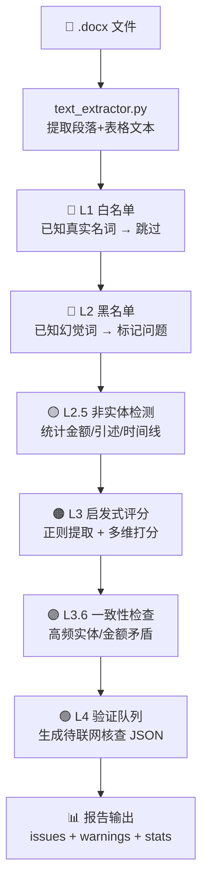
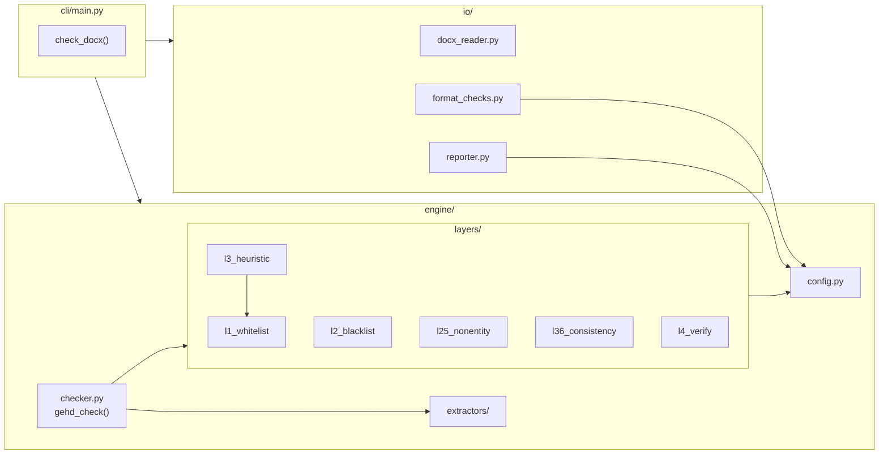

# GEHD 架构文档

> **版本**：v0.1.2  
> **最后更新**：2026-05-08  
> **目标读者**：AI 助手（Gemini/Claude/GPT/DeepSeek）或真人开发者  
> **阅读顺序**：本文 → [development.md](./development.md) → [ai-guide.md](./ai-guide.md)（AI 用户）→ 代码

---

## 一、项目是什么

**GEHD**（Generalized Entity Hallucination Detection）是一个**纯规则引擎**的文档幻觉核查工具。

输入一份 `.docx` 文档，GEHD 用五层规则引擎扫描其中的专有名词、统计数据、引述和时间线，标记出"可能被 AI 编造"的内容——即幻觉（hallucination）。

**核心差异化优势**：GEHD 不使用 LLM 自查（LLM 自查有"自己检查自己"的致命缺陷），而是用纯正则 + 启发式规则，结果可审计、可解释。

---

## 二、项目结构一览

```
GEHD项目/
├── pyproject.toml              # 项目元数据、依赖声明、工具配置
├── README.md                   # 项目首页
├── CHANGELOG.md                # 版本变更记录
├── ARCHITECTURE.md             # ← 你正在读的文件
├── DEVELOPMENT.md              # 开发指南
│
├── src/hallucination_checker/  # === 源代码（src-layout） ===
│   ├── __init__.py             # 包入口，定义 __version__
│   ├── __main__.py             # python -m 入口
│   │
│   ├── engine/                 # === 核心引擎层 ===
│   │   ├── config.py           # 全局配置（阈值、白/黑名单、正则模式）
│   │   ├── checker.py          # 主编排器：组合 L1→L4 全流程
│   │   ├── extractors/
│   │   │   └── text_extractor.py  # 从 docx 提取结构化文本块
│   │   ├── layers/             # === 五层规则引擎 ===
│   │   │   ├── l1_whitelist.py     # L1: 白名单放行
│   │   │   ├── l2_blacklist.py     # L2: 黑名单拦截
│   │   │   ├── l25_nonentity.py    # L2.5: 非实体幻觉检测
│   │   │   ├── l3_heuristic.py     # L3: 启发式评分（核心）
│   │   │   ├── l36_consistency.py  # L3.6: 内部一致性检查
│   │   │   └── l4_verify.py        # L4: 验证队列构建
│   │   └── scorers/            # 评分逻辑（预留，当前在 l3_heuristic.py）
│   │
│   ├── io/                     # === 输入输出层 ===
│   │   ├── docx_reader.py      # 文档加载 + 异常处理
│   │   ├── format_checks.py    # Check 1-5: 基础格式检查
│   │   └── reporter.py         # 报告格式化输出
│   │
│   ├── cli/                    # === 命令行入口（薄层） ===
│   │   └── main.py             # 参数解析 + 流程编排
│   │
│   └── gui/                    # GUI 层（预留，Iteration 3）
│
├── config/                     # === 外部化配置（JSON） ===
│   ├── whitelist.json          # L1 白名单（可编辑，引擎自动加载）
│   ├── blacklist.json          # L2 黑名单（可编辑，引擎自动加载）
│   ├── entity_patterns.json   # L3 实体提取正则规则
│   ├── l25_patterns.json      # L2.5 非实体检测正则规则
│   ├── exclude_words.json     # L3 排除词
│   ├── adjective_prefixes.json # L3.5 形容词前缀
│   └── thresholds.json        # 评分阈值 + 文本处理参数
│
├── tests/                      # === 测试 ===
│   ├── conftest.py             # 共享 fixtures（CheckResult 类等）
│   └── test_regression.py      # 回归测试套件
│
└── docs/                       # 项目文档
```

---

## 三、五层引擎数据流



### 各层详解

| 层 | 文件 | 输入 | 输出 | 核心逻辑 |
|------|------|------|------|------|
| **L1** | `l1_whitelist.py` | 候选实体词 | 放行/保留 | 精确匹配白名单词；子串匹配（2字前缀/3字+任意位置） |
| **L2** | `l2_blacklist.py` | 所有文本 | issues | 扫描已知幻觉词，命中即报错 |
| **L2.5** | `l25_nonentity.py` | 所有文本 | 候选列表 | 正则检测统计金额/百分比/规模描述/权威引述/直接引语/时间线 |
| **L3** | `l3_heuristic.py` | 所有文本 | 评分候选 | 正则提取 → 白名单过滤 → 排除词过滤 → 形容词降分 → 频率加分 → 可信字符降分 → 0-100 分输出 |
| **L3.6** | `l36_consistency.py` | L3 候选列表 | warnings | 同实体出现≥3次标记；同段落多金额共存标记 |
| **L4** | `l4_verify.py` | L2.5+L3 候选 | JSON 文件 | 汇总候选 → 按深度搜索阈值分深度/快速搜索 → 导出 `_l4_queue.json` |

### 评分维度（L3 核心）

一个候选实体词的 0-100 分由以下因素决定：

| 因素 | 方向 | 幅度 |
|------|------|------|
| 正则基础分（按类别） | 基础 | 25-60 |
| 形容词前缀（"权威科技"） | ↓ 降分 | -30 |
| 单字电商平台（"X购"） | ↑ 加分 | +15 |
| 文档中高频出现（≥3次） | ↑ 加分 | +10 |
| 中频出现（≥2次） | ↑ 加分 | +3 |
| 含可信字符（淘/京/拼等） | ↓ 降分 | -10 |
| 子串白名单剩余过长 | ↓ 降分 | -3/字（上限-15） |

**分级标准**：≥65 高危（issue）、45-64 中危（warning）、<45 低危（仅 L4 队列）

---

## 四、模块依赖关系



**依赖方向**：`cli` → `io` + `engine` → `layers` → `config`（单向，无循环）

---

## 五、配置系统

### 加载优先级

```
config/*.json（外部化）  >  engine/config.py（内置默认值）
```

如果 JSON 文件不存在或格式错误，自动回退到 `config.py` 中硬编码的默认值。

### 配置项分类

| JSON 文件 | 对应 config.py 变量 | 类型 | 用途 |
|------|------|------|------|
| `whitelist.json` | `WHITELIST` | `set[str]` | L1 白名单 |
| `blacklist.json` | `BLACKLIST` | `list[str]` | L2 黑名单 |
| `entity_patterns.json` | `ENTITY_PATTERNS` | `list[tuple]` | L3 实体提取正则 |
| `l25_patterns.json` | `L25_PATTERNS` | `list[tuple]` | L2.5 非实体检测正则 |
| `exclude_words.json` | `EXCLUDE_WORDS` | `set[str]` | L3 排除词 |
| `adjective_prefixes.json` | `ADJECTIVE_PREFIXES` | `set[str]` | L3.5 形容词前缀 |
| `thresholds.json` | `SCORE_*` 常量 + 文本参数 | `int` | 评分阈值、窗口大小等 |

### 自定义配置

编辑 `config/` 下的 JSON 文件即可。下次运行时自动加载。

**示例**——降低引擎敏感度（减少误报）：
```json
// config/thresholds.json → scores → high_threshold
"high_threshold": 75  // 从 65 提高到 75，更少的高危标记
```

---

## 六、测试体系

| 文件 | 用途 | 测试数 |
|------|------|------|
| `tests/conftest.py` | `CheckResult` 类封装 `check_docx()` 输出解析 | — |
| `tests/test_regression.py` | 核心回归测试，覆盖 L1-L4 + 边界条件 | 18 |

**运行**：`pytest tests/test_regression.py -v`（需要 `GEHD_RedTeam_v2_Document.docx` 测试文件）

**测试数据路径**：`~/Desktop/WorkBuddy/GEHD_Test_Suite/v2/GEHD_RedTeam_v2_Document.docx`

---

## 七、版本历史

| 版本 | 日期 | 关键变更 |
|------|------|------|
| **v0.2.0** | 2026-05-09 | Iteration 2 完成：类型安全+代码质量+日志+测试覆盖率 85% |
| **v0.1.2** | 2026-05-08 | 代码质量补丁：消除魔术数字 55、删除死代码、配置漂移修复 |
| **v0.1.1** | 2026-05-08 | 代码质量补丁：测试修复、版本统一、globals() 重构 |
| **v0.1.0** | 2026-05-08 | Iteration 1 完成：从单文件脚本迁移为标准 Python 项目 |
| **v3.6** | 2026-04-23 | 前身：单文件 806 行 `docx_self_check.py` |

---

## 八、当前开发路线

```
✅ Iteration 1: 规范化 v0.1.x（已完成）
   ├── P0-1: Git 仓库初始化
   ├── P0-2: src-layout 目录结构
   ├── P0-3: pyproject.toml
   ├── P0-4: 拆分 806 行 → 14 个模块
   └── P0-5: 外部化配置 → JSON

✅ Iteration 2: 工程化 v0.2.0（已完成）
   ├── ✅ P1-0: GEHDConfig dataclass 重构 — 30+全局变量→单dataclass
   ├── ✅ P1-1: 全量类型注解 — mypy 22文件零错误
   ├── ✅ P1-2: Ruff 格式化 + lint — 16文件格式化，25 lint→0
   ├── ✅ P1-3: logging 文件日志 — gehd.log 含时间戳+结构化消息
   ├── ✅ P1-4: 异常处理标准化 — except Exception→精确异常类型
   └── ✅ P1-5: 单元测试 — 27新测试，覆盖率 30%→85%

🔮 Iteration 3: 壁垒化 v0.3.0（远期）
   ├── P2-1: 声明提取模块（NLP 分句）
   ├── P2-2: 适配层设计
   ├── P2-3: L4 联网搜索自动核查
   ├── P2-4: 证据链生成
   └── P2-5: 多模型交叉校验
```
