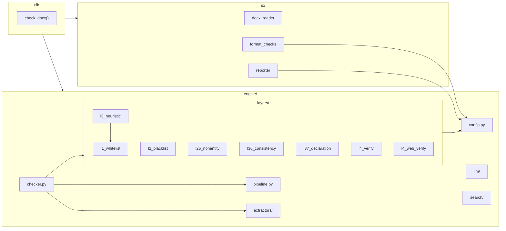

# GEHD 架构文档

> **版本**：v0.5.2  
> **最后更新**：2026-05-17  
> **目标读者**：AI 助手（Gemini/Claude/GPT/DeepSeek）或真人开发者  
> **阅读顺序**：本文 → [development.md](./development.md) → [ai-guide.md](./ai-guide.md)（AI 用户）→ 代码

---

## 一、项目是什么

**GEHD**（Generalized Entity Hallucination Detection）是一个**规则+LLM+搜索三层管道**的文档幻觉核查工具。

输入一份文档（.docx/.pdf/.md 等），GEHD 用六层规则引擎扫描可疑内容，再通过可配置的管道（full 高可信 / fast 快速低成本 / offline 纯规则离线）进行 LLM 辅助过滤和联网验证。用户按需选择核查深度。

**核心差异化优势**：
- **三路径按需选深度**：关键文档走 full（规则+搜索+LLM），批量扫描走 fast（规则+LLM 直接核验），离线环境走 offline（纯规则，零 API 成本）
- **全链路可审计**：每个管道阶段的决策写入 decision_log，可通过 CLI --audit 或 GUI 审计视图追溯
- **配置驱动，零代码调优**：白名单/黑名单/评分阈值全部外部化 JSON，修改即生效

---

## 二、项目结构一览

```
GEHD项目/
├── pyproject.toml              # 项目元数据、依赖声明、工具配置
├── README.md                   # 项目首页
├── CHANGELOG.md                # 版本变更记录
├── architecture.md               # ← 你正在读的文件
├── development.md                # 开发指南
│
├── src/hallucination_checker/  # === 源代码（src-layout） ===
│   ├── __init__.py             # 包入口，定义 __version__
│   ├── __main__.py             # python -m 入口
│   │
│   ├── engine/                 # === 核心引擎层 ===
│   │   ├── config.py           # 全局配置（阈值、白/黑名单、正则模式）
│   │   ├── checker.py          # 主编排器：组合 L1→L4 全流程
│   │   ├── pipeline.py         # 管道编排器（注册表驱动三路径 full/fast/offline，含 PipelineContext.status + STAGE_CONTRACTS + ADAPTER_CONTRACTS）
│   │   ├── direct_verify.py    # LLM 直接核验（fast 路径，零搜索开销）
│   │   ├── logger.py           # 扫描日志系统（gehd.log + workspace/scans/ JSON 归档）
│   │   │   └── text_extractor.py  # 从 docx 提取结构化文本块
│   │   ├── layers/             # === 六层规则引擎 ===
│   │   │   ├── l1_whitelist.py     # L1: 白名单放行
│   │   │   ├── l2_blacklist.py     # L2: 黑名单拦截
│   │   │   ├── l25_nonentity.py    # L2.5: 非实体幻觉检测
│   │   │   ├── l3_heuristic.py     # L3: 启发式评分（核心）
│   │   │   ├── l36_consistency.py  # L3.6: 内部一致性检查
│   │   │   ├── l37_declaration.py  # L3.7: 声明性构造检测
│   │   │   ├── l4_verify.py        # L4: 验证队列构建
│   │   │   └── l4_web_verify.py    # L4: 联网自动核查
│   │   ├── llm/                # === LLM 适配层 ===
│   │   │   ├── adapter.py      # LLMAdapter + OpenAIAdapter
│   │   │   ├── pre_filter.py   # 前置过滤器：批量去噪，压缩候选
│   │   │   └── post_filter.py  # 后置判断：语义深度验证（H01 纠正）
│   │   ├── search/             # === 搜索适配层 ===
│   │   │   └── adapter.py      # SearchAdapter 抽象 + TavilyAdapter + DuckDuckGoAdapter
│   │   └── scorers/            # 评分逻辑（预留，当前在 l3_heuristic.py）
│   │
│   ├── io/                     # === 输入输出层 ===
│   │   ├── document_text.py    # 格式无关文档中间表示，8种工厂方法（DOCX/TXT/MD/HTML/JSONL/CSV/PDF/PPTX）
│   │   ├── docx_reader.py      # 文档加载 + 异常处理
│   │   ├── format_checks.py    # Check 1-5: 基础格式检查
│   │   └── reporter.py         # 报告格式化输出
│   │
│   ├── cli/                    # === 命令行入口（薄层） ===
│   │   └── main.py             # 参数解析 + 流程编排
│   │
│   └── gui/                    # GUI 层（PySide6 桌面应用：全文高亮、三套主题、管道状态栏、QThread 异步扫描，配置统一由设置对话框管理）
│
├── config/                     # === 外部化配置（JSON） ===
│   ├── whitelist.json          # L1 白名单（可编辑，引擎自动加载）
│   ├── blacklist.json          # L2 黑名单（可编辑，引擎自动加载）
│   ├── entity_patterns.json   # L3 实体提取正则规则
│   ├── l25_patterns.json      # L2.5 非实体检测正则规则
│   ├── declaration_patterns.json # L3.7 声明性构造检测正则规则
│   ├── exclude_words.json     # L3 排除词
│   ├── adjective_prefixes.json # L3.5 形容词前缀
│   ├── pipeline.json          # 管道模式配置
│   ├── llm.json               # LLM 供应商/模型
│   └── search.json            # 搜索后端配置
│   └── thresholds.json        # 评分阈值 + 文本处理参数
│
├── tests/                      # === 测试 ===
│   ├── conftest.py             # 共享 fixtures（CheckResult 类等）
│   ├── test_regression.py      # 回归测试套件
│   ├── test_unit.py            # 单元测试（L1-L4 各层）
│   ├── test_declaration.py     # L3.7 声明提取测试
│   ├── test_io_factories.py    # IO 工厂方法测试
│   ├── test_gui.py             # GUI 测试
│   ├── test_layers/            # 分层测试
│   └── test_io/                # IO 层测试
│
└── docs/                       # 项目文档
```

---

## 三、六层引擎数据流

```
📄 .docx 文件
    │
    ▼
文本提取器 (段落 + 表格)
    │
    ├── L1 白名单 ─── 已知真实词 → 跳过
    ├── L2 黑名单 ─── 已知幻觉词 → 标记 issue
    ├── L2.5 非实体 ── 统计金额 / 引述 / 时间线
    ├── L3 启发式 ─── 正则提取 + 多维打分 (0-100)
    ├── L3.6 一致性 ── 高频实体 / 金额矛盾
    ├── L3.7 声明提取 ─ 6 类声明性构造检测
    ├── L4 验证队列 ── 汇总候选 → _l4_queue.json
    ├── L4 联网核查 ── Tavily / DuckDuckGo → 4 种标签
    ├── L4 证据链 ─── 四段结构 (scoring / consistency / verification / recommendation)
    └── P2-5 交叉校验 ─ 三路并行 → 强 / 弱 / 分歧共识
            │
            ▼
       📊 报告输出 (issues + warnings + stats)
```

### 各层详解

| 层 | 文件 | 输入 | 输出 | 核心逻辑 |
|------|------|------|------|------|
| **L1** | `l1_whitelist.py` | 候选实体词 | 放行/保留 | 精确匹配白名单词；子串匹配（2字前缀/3字+任意位置） |
| **L2** | `l2_blacklist.py` | 所有文本 | issues | 扫描已知幻觉词，命中即报错 |
| **L2.5** | `l25_nonentity.py` | 所有文本 | 候选列表 | 正则检测统计金额/百分比/规模描述/权威引述/直接引语/时间线 |
| **L3** | `l3_heuristic.py` | 所有文本 | 评分候选 | 正则提取 → 白名单过滤 → 排除词过滤 → 形容词降分 → 频率加分 → 可信字符降分 → 0-100 分输出 |
| **L3.6** | `l36_consistency.py` | L3 候选列表 | warnings | 同实体出现≥3次标记；同段落多金额共存标记 |
| **L3.7** | `l37_declaration.py` | 所有文本 | issues | 6类声明性构造检测（语义声明、断言、因果、量化、对比、条件） |
| **L4** | `l4_verify.py` | L2.5+L3 候选 | JSON 文件 | 汇总候选 → 按深度搜索阈值分深度/快速搜索 → 导出 `_l4_queue.json` |
| **L4 联网** | `l4_web_verify.py` | L4 队列 | 验证结果 | Tavily + DuckDuckGo 双后端自动切换 → 4种结果标签（verified_real/verified_fake/need_manual_check/unable_to_verify） |
| **L4 证据链** | `checker.py`（集成） | 验证结果 + 原始评分 | 证据链 | 四段结构：scoring（评分维度详述）/ consistency（一致性信号）/ verification（联网验证结果）/ recommendation（最终建议） |
| **P2-5 交叉校验** | `cross_validate.py` | 多源验证结果 | 共识报告 | 三路并行验证 → 强共识/弱共识/分歧三档 |

### 评分维度（L3 核心）

一个候选实体词的 0-100 分由以下因素决定：

| 因素 | 方向 | 幅度 |
|------|------|------|
| 正则基础分（按类别） | 基础 | 25-60 |
| 形容词前缀（"权威科技"） | ↓ 降分 | -30 |
| 单字电商平台（"X购"） | ↑ 加分 | +15 |
| 文档中高频出现（≥3次） | ↑ 加分 | +10 |
| 中频出现（≥2次） | ↑ 加分 | +3 |
| 含可信字符（淘/京/拼等） | ↓ 降分 | -10 |
| 子串白名单剩余过长 | ↓ 降分 | -3/字（上限-15） |

**分级标准**：≥65 高危（issue）、45-64 中危（warning）、<45 低危（仅 L4 队列）

---

### 管道调度层

上述 L1-L4 引擎层由 `engine/pipeline.py` 统一调度。用户选择验证模式后，管道编排器按注册表自动组合阶段序列，每阶段执行前验证契约，执行后写入 decision_log。各层代码不变，只变调度方式。

---

## 四、模块依赖关系



**依赖方向**：`cli` → `io` + `engine` → `layers` → `config`（单向，无循环）

---

## 五、配置系统

### 加载优先级

```
config/*.json（外部化）  >  engine/config.py（内置默认值）
```

如果 JSON 文件不存在或格式错误，自动回退到 `config.py` 中硬编码的默认值。

### 配置项分类

| JSON 文件 | 对应 config.py 变量 | 类型 | 用途 |
|------|------|------|------|
| `whitelist.json` | `WHITELIST` | `set[str]` | L1 白名单 |
| `blacklist.json` | `BLACKLIST` | `list[str]` | L2 黑名单 |
| `entity_patterns.json` | `ENTITY_PATTERNS` | `list[tuple]` | L3 实体提取正则 |
| `declaration_patterns.json` | `DECLARATION_PATTERNS` | `list[tuple]` | L3.7 声明性构造检测正则 |
| `l25_patterns.json` | `L25_PATTERNS` | `list[tuple]` | L2.5 非实体检测正则 |
| `exclude_words.json` | `EXCLUDE_WORDS` | `set[str]` | L3 排除词 |
| `adjective_prefixes.json` | `ADJECTIVE_PREFIXES` | `set[str]` | L3.5 形容词前缀 |
| `secrets.json` | `TAVILY_API_KEY` 等 | `str` | L4 搜索后端 API 密钥 |
| `thresholds.json` | `SCORE_*` 常量 + 文本参数 | `int` | 评分阈值、窗口大小等（l4 块标记 deprecated） |
| `pipeline.json` | 管道配置 | `dict` | 管道步骤与参数 |
| `llm.json` | LLM 配置 | `dict` | LLM 模型与 API 参数 |
| `search.json` | 搜索配置 | `dict` | 搜索后端与切换策略 |
| — | `_migrate_l4_to_search()` | — | 自动迁移旧 thresholds.json l4 块到 search.json |

### 自定义配置

编辑 `config/` 下的 JSON 文件即可。下次运行时自动加载。

**示例**——降低引擎敏感度（减少误报）：
```json
// config/thresholds.json → scores → high_threshold
"high_threshold": 75  // 从 65 提高到 75，更少的高危标记
```

---

## 六、测试体系

| 文件 | 用途 | 测试数 |
|------|------|------|
| `tests/test_regression.py` | 核心回归测试，覆盖 L1-L4 + 边界条件 | 18 |
| `tests/test_unit.py` | 单元测试（L1-L4 各层独立验证） | 27 |
| `tests/test_declaration.py` | L3.7 声明提取专项测试 | 5 |
| `tests/test_io_factories.py` | IO 工厂方法测试 | 若干 |
| `tests/test_gui.py` | GUI 组件测试 | 若干 |
| `tests/test_layers/` | 分层独立测试 | 若干 |
| `tests/test_io/` | IO 层独立测试 | 若干 |
| **合计** | | **127** |

**运行**：`pytest tests/ -v`

---

## 七、管道架构（v0.5.0）

### 7.1 三路径模式

full:  规则引擎 → LLM前置过滤 → 联网搜索 → LLM后置纠正 → 后处理
fast:  规则引擎 → LLM前置过滤 → LLM直接核验 ────────────→ 后处理
offline: 规则引擎 ──────────────────────────────────────→ 后处理

### 7.2 PipelineContext 统一数据格式

管道各阶段通过 PipelineContext 交换数据，包含：
- candidates: list[dict] — 候选实体列表
- l4_queue: list[dict] — L4 待验证队列
- decision_log: list[dict] — 结构化决策追溯
- status: PipelineStatus — 管道运行状态

### 7.3 双层契约验证

管道启动时一次性验证所有阶段的前置条件：

STAGE_CONTRACTS — 阶段间数据验证
  - requires: 输入字段必须存在且非空
  - produces: 输出字段名
  - requires_nested: 嵌套路径验证（如 l4_queue[*].search_result.snippets）

ADAPTER_CONTRACTS — 外部能力配置验证
  - requires_config: 必需配置键（如 llm.json.model）
  - forbidden_values: 禁止的占位值（如 'gpt-4o'）

双层契约杜绝了 v0.4.0-rc 的全部 8 类故障（接线缺失/数据缺失/字段不对齐/配置读后丢弃等）。

---

## 八、日志系统（v0.5.1）

### engine/logger.py

统一日志模块，两路输出：
- **gehd.log**：运行日志（INFO/WARNING/ERROR），文本格式，滚动追加
- **workspace/scans/**：扫描结果 JSON 归档（`scan_YYYYMMDD_HHMMSS.json`），每次扫描一条

JSON 归档含：时间戳、输入文件、管道模式、各阶段决策摘要、issues/warnings 数量。

---

## 九、用户数据目录（v0.5.2）

### E 接口

- `get_user_data_dir()` — 返回跨平台用户数据目录（macOS `~/Library/Application Support/GEHD/`，Windows `%APPDATA%/GEHD/`，Linux `~/.local/share/GEHD/`）
- `save_user_config(key, value)` — 保存用户偏好到 `user_config.json`

### GUI Key 管理

设置对话框「API 密钥」选项卡统一管理 tavily_api_key 和 llm_api_key，写入用户数据目录下的 `secrets.json`，替代项目根目录手改。

---

## 十、版本历史

| **v0.5.2** | 2026-05-16 | 用户数据目录：get_user_data_dir + GUI Key 管理 |

| **v0.5.1** | 2026-05-16 | 日志系统：logger.py + gehd.log + workspace/scans/ JSON 归档 |

| **v0.5.0-beta** | 2026-05-13 | 审计链路：decision_log + --audit + 审计视图 |

| 版本 | 日期 | 关键变更 |
|------|------|------|
| **v0.5.0-alpha** | 2026-05-13 | 契约式管道 + 注册表三路径 + direct_verify + PipelineContext.status |
| **v0.4.0** | 2026-05-13 | 智能管道完整：LLM 前/后置 + GUI 管道选项卡 + S 组战略 |
| **v0.4.0-beta** | 2026-05-13 | LLM 前置过滤器 + GUI 管道选项卡 + 配置自动迁移 |
| **v0.4.0-alpha** | 2026-05-13 | 管道编排器 + LLM 适配层 + SearchAdapter 抽象 + 配置三分层 |
| **v0.3.0** | 2026-05-12 | P2-1~P2-5 全功能 + GUI 桌面应用 + 六方协作 |
| **v0.2.0** | 2026-05-09 | Iteration 2 完成：类型安全+代码质量+日志+测试覆盖率 85% |
| **v0.1.2** | 2026-05-08 | 代码质量补丁：消除魔术数字 55、删除死代码、配置漂移修复 |
| **v0.1.1** | 2026-05-08 | 代码质量补丁：测试修复、版本统一、globals() 重构 |
| **v0.1.0** | 2026-05-08 | Iteration 1 完成：从单文件脚本迁移为标准 Python 项目 |
| **v3.6** | 2026-04-23 | 前身：单文件 806 行 `docx_self_check.py` |

---

```
